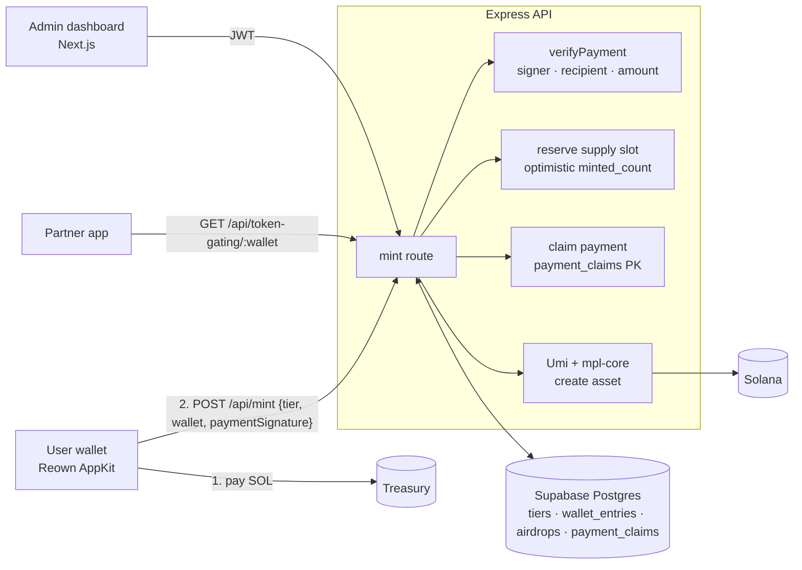

# Solana Member Passes

A full-stack platform for **tiered membership NFTs on Solana**: Bronze, Silver, Gold and any future tiers, each its own **Metaplex Core** collection. It supports paid public mints, Candy Machine drops, admin airdrops, token gating for partner apps, and an admin dashboard to run it all.

This is a white-label build of a platform I delivered for a trading community, where membership tiers unlock features in their products.

---

## Features

| Area | What it does |
|---|---|
| **Tiers** | Admin-defined tiers with supply caps, SOL price, artwork and metadata (pinned to IPFS). Each tier is a Metaplex Core collection created from the dashboard. |
| **Paid mint** | The user pays the treasury from their wallet, then the backend **verifies the payment on-chain** (signer, recipient, amount) and mints the asset with the collection authority. |
| **Candy Machine** | Optional per-tier Candy Machine v3 drops. The backend prepares the transaction and the user signs it; payment is enforced by on-chain guards. |
| **Airdrops** | Batch airdrops to wallet lists, with per-recipient status tracking (pending, success, failed, skipped). |
| **Token gating API** | `GET /api/token-gating/:wallet` returns a wallet's tiers, highest tier and held passes, so partner apps can unlock features by tier. |
| **Allow / deny lists** | Whitelist and blacklist entries with optional expiry, enforced at mint time. |
| **Admin dashboard** | JWT and bcrypt auth with roles (`SUPER_ADMIN`, `ADMIN`); manage tiers, wallets, airdrops and settings; CSV export of holders. |

## Architecture



## Security fixes in this build

I reviewed the original mint flow before publishing it and fixed:

| Severity | Issue | Fix |
|---|---|---|
| 🔴 High | **Payment replay.** The mint endpoint verified that a transaction paid the treasury but never recorded the signature, so **one payment could be resubmitted to mint unlimited paid passes**. | `payment_claims` table keyed by signature: a payment funds exactly one mint. Released if the mint itself fails, so users can retry. |
| 🟠 Medium | The payer only had to *appear* in the transaction's accounts, not sign it. | `verifyPayment` requires the payer to be one of the transaction's signers. |
| 🟠 Medium | `minted_count` was read, then incremented after minting, so concurrent mints could exceed a tier's supply cap. | Atomic slot reservation (`UPDATE … WHERE minted_count = <read value>`) before minting, released on failure. |
| 🟡 Low | The backend didn't compile (missing `Transaction` / `SystemProgram` imports in an unused helper, a wrong property name in CSV export, `jsonwebtoken` typing). | Removed the dead helper and fixed the types; backend and frontend both pass `tsc --noEmit`. |

## Tech stack

**Backend:** Node.js · Express · TypeScript · Zod · Supabase (Postgres) · Metaplex Umi · `mpl-core` · Candy Machine v3 · `@solana/web3.js` · JWT · bcrypt · Helmet · rate limiting

**Frontend:** Next.js 16 (App Router) · React · TypeScript · Tailwind CSS · shadcn/ui · Reown AppKit (Solana adapter)

## Running locally

```bash
# database: run backend/src/db/schema.sql in the Supabase SQL editor
cp backend/.env.example backend/.env          # Supabase, Solana RPC, authority key, treasury, JWT
cp frontend/.env.example frontend/.env.local  # API URL, network, Reown project id
npm run install:all
(cd backend && npx tsx src/db/seed.ts)     # creates tiers + a default admin (change its password)
npm run dev
```

`backend/src/db/seed.ts` creates a development admin with a placeholder password. Change it before deploying anywhere.

## Repository layout

```
backend/src/
  routes/     tiers, mint, candy-machine, airdrops, wallets, token-gating, export, admin
  solana/     umi setup, collections, minting + payment verification, candy machine, token gating
  db/         schema.sql, seed.ts
frontend/app/
  page.tsx, my-nfts/     public mint and holdings
  admin/                 dashboard: tiers, wallets, airdrops, export, settings
*_PASS.json              sample tier metadata
```
